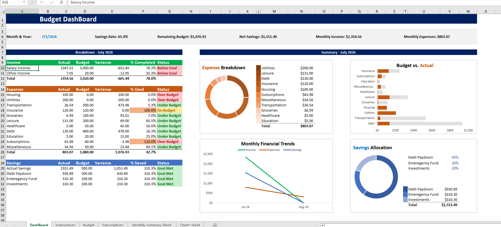

# Excel Budget Dashboard
A dynamic personal finance dashboard built in Microsoft Excel using advanced formulas, dynamic arrays, conditional formatting, and interactive visualizations

## Dashboard Preview

## Features

- Dynamic month selection
- Budget vs. Actual analysis
- Automated savings allocation
- Subscription tracking with automatic renewal dates
- Monthly financial trend analysis
- Dynamic KPI dashboard
- Interactive charts and visualizations
- Conditional formatting with status indicators
- Structured transaction database
- Automated monthly summaries

---

## Workbook Structure

### Dashboard
- Executive KPI summary
- Expense Breakdown
- Budget vs. Actual comparison
- Monthly Financial Trends
- Savings Allocation

### Transactions
- Dynamic transaction database
- Category-based expense tracking
- Month filtering

### Budget
- Monthly budget targets
- Variance calculations
- Status tracking

### Subscriptions
- Monthly and annual subscriptions
- Automatic renewal tracking
- Category integration

### Monthly Summary
- Historical monthly reporting
- Dynamic data source for trend analysis

---
## How It Works

1. Record income and expenses in the Transactions sheet.
2. Assign each transaction to a category.
3. Select the reporting month on the Dashboard.
4. The dashboard automatically updates KPIs, charts, budget comparisons, savings allocation, and monthly trends.
## Excel Functions Used

---
- SUMIFS
- FILTER
- SORT
- CHOOSECOLS
- IF / IFERROR
- TEXT
- EOMONTH
- DATE
- ABS
- Structured Table References
- Conditional Formatting
- Dynamic Charts

## Skills Demonstrated

- Financial Reporting
- Dashboard Design
- Data Visualization
- Budget Analysis
- KPI Reporting
- Dynamic Excel Modeling
- Advanced Excel Formulas
- Financial Planning
- Data Automation
